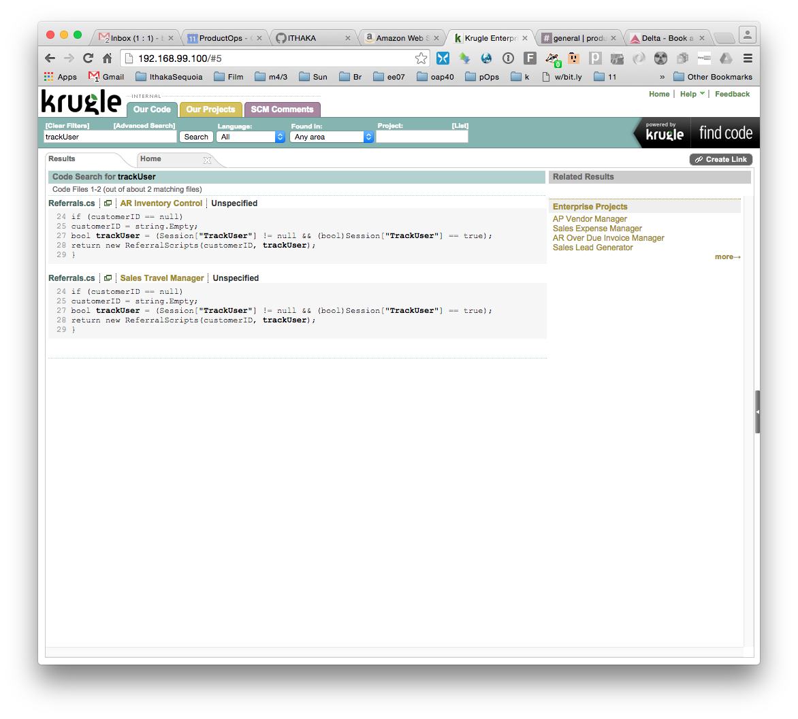

# GENERAL PROCEDURES

Our starting point is a RAR file of a VMware VM instance named "Krugle Enterprise 2.4.3 32bit 40Gb", and we start this vmware instance with both VMware as well as with VirtualBox.  

# MAKE AN INITIAL CONTAINER WITH THE RAW TARBALL

First we naievely pack up all the files using the technique outlined in the How-To-Centos4-Docker-Base-Image.md, section "Collect A Tarball"

Then we import the tarball into a container which we'll use for further work.  This is not our final container.    
   `docker import ketarball.tar bdobyns/ke2431`


# FORENSICS ON A RUNNING SYSTEM 

We want to look around in the running system, so after we pack up the files, we start the source vm and look inside.

A first look inside the KE makes it appear that it's running Redhat
4.4 `cat /etc/redhat-release` but a comparison of the actual version
numbers of most of the packages reveals that this is a bastard box,
updated to Centos4.6 (also as seen in /etc/yum.repos.d).

Examining the output of `ps` or `top` The application itself seems to
consist of two java containers, resin and jetty, an apache and a
mysqld.

Most of the application appears to be in `/data/krugle`

The mysql databases are in the usual location in `/var/lib/mysql` and mysqld runs as user 'mysql'

Apache's webroot is someplace in `/data/krugle` and apache runs as 'webmaster'

The KE ran the `resin` and `jetty` containers as root, we will want to run them as a less priviliged user, most likely with `gosu`.

Lots of files in `/etc` are changed to fixup the configuration

Most of the packages seem to be stock standard packages from the
Redhat or Centos repos.  We will figure out subsequently exactly which
packages are not in a repo, or are different enough they need to be
updated from the stock 4.6 image.

Using `lsof -i` we see that apache runs on port 80, mysqd runs on 3306, hub runs on 8080 and resin-krugle-api runs on 9100.


# SEPARATE THE APP FROM THE OS

The
[bdobyns/centos4.6_i386](https://hub.docker.com/r/bdobyns/centos4.6_i386/)
(which see) is substantially similar to the KE 2.4.3.1 - we need to
find out what files are different and only move those over.  

In addition the [bdobyns/centos4.6_i386](https://hub.docker.com/r/bdobyns/centos4.6_i386/) has yum installed and working
(the KE did not, as a security measure), and has
[gosu](https://github.com/tianon/gosu) installed.

inside a centos46  `rpm -qa | sort >centos46base_rpm_qa.txt`

inside a ke `rpm -qa | sort >ke_rpm_qa.txt`

To find the packages only in a ke  `diff -y centos46base_rpm_qa.txt ke_rpm_qa.txt`  
You can safely ignore lines marked '<' which are packages that are in the Centos4.6 but not in the KE, this is benign.  
You may be tempted to only look at the lines which are marked with '>' but this is incorrect, as there may be lines marked with '|' which are significantly different too.  

Check the list to be sure the exact version of the packages the KE needs are available in http://vault.centos.org/4.6/os/i386/CentOS/RPMS/   
This is the list of packages that the repo contains and the KE needs: 

```
apr apr-util atk cpp curl cvs distcache expect gcc gcc-java
glibc-devel glibc-headers glibc-kernheaders gtk2 httpd httpd-suexec
java-1.4.2-gcj-compat libgcj libgcj-devel neon mod_python mod_ssl
mysql mysql-server pango perl-DBD-MySQL perl-DBI perl-URI php php-pear
postgresql-libs libidn libxslt-devel mod_perl specspo zip
```

Packages not available in the base repo (came from who knows where)

| Package | explanation | Needed? |
| ------- | ----------- | ------- |
| jed | jed editor | no |
| jed-common | jed editor | no |
| compat-slang | jed editor | no |
| jdk-1.5.0_09-fcs | sun jdk | yes |
| subversion-1.4.6 | newer version than repo | yes |
| sysreport | - | no |
| rpmforge-release-0.3.6-1 | add the dag repo | no |
| enscript-1.6.4-2 | newer version | yes |
| apt-0.5.15lorg3.2-1.el4.rf | alternative to rpm | no |
| rsync-3.0.0 | newer version | ? |


Run bash in a container with your docker image, and use rpm to ininstall and repackage each of these, e.g.    
`rpm --repackage jdk-1.5.0_09-fcs` which puts the rebundled RPM in `/var/spool/repackage/jdk-1.5.0_09-fcs.i586.rpm`    
and then copy the resulting RPMs out of the vm


# BUNDLE UP THE APP WITHOUT THE OS

Since most of  it seems to be in just three places (from FORENSICS, above), we're going to package up only those three directories.  This particular app originally had an installer package (not an RPM) and if we still had the installer, we might make better choices when we pack up the application files.   

Inside the running container, we create three tarballs:

```
cd /
tar czf /tmp/etc.tar.gz etc
tar czf /tmp/mysql-data.tar.gz var/lib/mysql
tar czf /tmp/data-krugle.tar.gz data/krugle
```

and then copy them out of the instance:

```
  mkdir application
  docker cp e6a61a81a61d:/tmp/etc.tar.gz application
  docker cp e6a61a81a61d:/tmp/mysql-data.tar.gz application/
  docker cp e6a61a81a61d:/tmp/data-krugle.tar.gz application/
```

It's possible that you end up grabbing a copy of some old data down
inside /data/krugle somewhere, and we'll have to sort that out later.
It's also possible there's some old data in the mysql database we grab
up.  In most rescue missions, grabbing up the app-specific data is
actually thought to be a good thing, but for this app, we actually
would prefer to have a clean image.


# BUILD AN AUGMENTED BASE IMAGE

The goal is to have a base image that consists only of 'standard
packages' that are application dependencies, but are not unique to the
application.  We do this by creating a dockerfile for the purpose.

```
# this builds a Centos OS image that's ready to add the application to,
# and has all the dependencies of the KE application included, 
# but without the application itself

# start with the centos base
FROM bdobyns/centos4.6_i386

# now install all the standard packages we can get from 
# the centos vault server (which the FROM image above points at)
RUN yum install -y apr apr-util atk cpp curl cvs distcache expect gcc gcc-java \
    glibc-devel glibc-headers glibc-kernheaders gtk2 httpd httpd-suexec \
    java-1.4.2-gcj-compat libgcj libgcj-devel neon mod_python mod_ssl \
    mysql mysql-server pango perl-DBD-MySQL perl-DBI perl-URI php php-pear \
    postgresql-libs libidn libxslt-devel mod_perl specspo zip

```

Now we build with the Dockerfile, and can safely push this to a public repository since it doesn't have anything in it (yet) that cannot be redistributed.

```
	docker build  -t  bdobyns/centos4.6_i386_mysql4  -f  Dockerfile.centos4+mysql4   .
	docker push bdobyns/centos4.6_mysql4
```


# BUILD AN IMAGE WITH THE REPACKAGED RPMS

Start bash in the first docker image, and try to re-install each of the rpms one by one, to make sure they work right.  You'll need to install with `rpm -U --nomd5 --nodigest --nosignature foo.rpm`.   

We notice that the jdk-1.5 doesn't reinstall cleanly, which is hardly a surprise, since Sun did some weird things with the way that they packaged Java back in the day.   Happily we can go to the Oracle (they bought Sun) website and get the ancient original distribution.   
   http://www.oracle.com/technetwork/java/javasebusiness/downloads/java-archive-downloads-javase5-419410.html#jdk-1.5.0_09-oth-JPR   
But you can't just curl the URL because ... accepting the dumb license.

Unfortunately, the JDK you download from this era is packaged as a binary executable that, after execution and acceptance of the license, writes a copy of the RPM that can *then* be installed.   Go ahead and run the executable file [per the instructions](http://www.oracle.com/technetwork/java/javase/install-linux-141396.html#install-rpm) and copy the rpm out.  

Now we create a dockerfile to add in the JDK and few remaining little bits.

```
# this adds in the JDK and a few other RPMs we had to --repackage

# start with the centos base that has mysql and some other stuff
FROM bdobyns/centos4.6_i386_mysql4

# now, there's a few RPMS that we had to --repackage and need to install
# in most cases we don't really know where the KE developers got them, or
# how to find a pristine copy again, so we just reuse the RPMS we have
RUN mkdir /var/spool/nonstd.rpms
COPY  ke-rpms/compat-slang-1.4.5-8.i386.rpm  /var/spool/nonstd.rpms
COPY  ke-rpms/enscript-1.6.4-2.i586.rpm  /var/spool/nonstd.rpms
COPY  ke-rpms/jed-0.99.14-2.i386.rpm  /var/spool/nonstd.rpms
COPY  ke-rpms/jed-common-0.99.14-2.i386.rpm  /var/spool/nonstd.rpms
COPY  ke-rpms/rsync-3.0.0-1.el4.rf.i386.rpm  /var/spool/nonstd.rpms
COPY  ke-rpms/subversion-1.4.6-0.1.el4.rf.i386.rpm  /var/spool/nonstd.rpms
#  we MUST install with --nosignature since these were repackaged
RUN rpm --upgrade --nomd5 --nodigest --nosignature /var/spool/nonstd.rpms/*rpm  && rm -rf /var/spool/nonstd.rpms/*rpm

# note the jdk we repackaged from the old KE didn't reinstall cleanly
# so we went and got the real deal from Sun/Oracle
# http://www.oracle.com/technetwork/java/javasebusiness/downloads/java-archive-downloads-javase5-419410.html#jdk-1.5.0_09-oth-JPR
COPY  ke-rpms/jdk-1_5_0_09-linux-i586.rpm  /var/spool/nonstd.rpms
RUN rpm --upgrade /var/spool/nonstd.rpms/jdk-1_5_0_09-linux-i586.rpm 

```

Build with this Dockerfile and we can safely push this to a public repository as well.

```
	docker build   -t  bdobyns/centos4.6_i386_mysql4_jdk5  -f Dockerfile.centos4+mysql4+jdk5  .
	docker push bdobyns/centos4.6_i386_mysql4_jdk5
```


# INSTALL THE APPLICATION ITERATION 1

Now we're ready to start to iterate on a Dockerfile that will install
the application pieces and try to start it.  We begin with just
installing the application pieces.

It will take some trial-and-error to figure out how to get everything working right.

```
FROM bdobyns/centos4.6_mysql4_jdk5
COPY application/etc.tar.gz /
COPY application/mysql-data.tar.gz /
COPY application/data-krugle.tar.gz /
```

We'll build at this point, tag it, 

```
docker build -f Dockerfile.iter1 -t bdobyns/ke_iter1 .
docker run -i -t bdobyns/ke_iter1 /bin/bash
```

Then try to get the parts running inside from a shell prompt.

# INSTALL THE APPLICATION ITERATION 2

It turns out that we need some additional stuff, links and such to be made, which we add to another Dockerfile

```
# for some reason, the pidfile dir has the wrong onwership and permissions
RUN chown mysql:mysql /var/run/mysqld && chmod ugo+rwx /var/run/mysqld

# delete some old pid and lock files
RUN rm -rf /var/lock/subsys/hub /var/run/mysqld/*

# well, somehow this link wasn't made.
RUN ln -s /usr/java/jdk1.5.0_09/bin/java /usr/local/bin/java

# these are specific to the KE
RUN ln /usr/sbin/httpd /usr/sbin/httpd-ent
RUN ln /usr/sbin/httpd /usr/sbin/httpd.org
```

Now it turns out that we have a bunch of perl modules that are not present, but necessary.  Back in the day, we would have installed them with `cpan`, but that's no longer possible with a perl this ancient.  Poot.

LWP::UserAgent  XML::LibXML XML::LibXSLT HTTP::BrowserDetect HTTP::Status HTML::StripScripts::Regex  ModPerl::Registry

Looking inside the KE we packed up we see these are all over the place.  Sigh.

```
                 
[root@ea8ce0bf4570 /]# find ls /usr/lib/perl5 -iname LWP
find: ls: No such file or directory
/usr/lib/perl5/site_perl/5.8.5/i386-linux-thread-multi/auto/LWP
/usr/lib/perl5/site_perl/5.8.5/LWP
[root@ea8ce0bf4570 /]# find /usr/lib/perl5 -iname LWP
/usr/lib/perl5/site_perl/5.8.5/i386-linux-thread-multi/auto/LWP
/usr/lib/perl5/site_perl/5.8.5/LWP
[root@ea8ce0bf4570 /]# find /usr/lib/perl5 -iname XML
/usr/lib/perl5/site_perl/5.8.5/XML
/usr/lib/perl5/site_perl/5.8.5/i386-linux-thread-multi/XML
/usr/lib/perl5/site_perl/5.8.5/i386-linux-thread-multi/auto/XML
[root@ea8ce0bf4570 /]# find /usr/lib/perl5 -iname HTTP
/usr/lib/perl5/site_perl/5.8.5/HTTP
/usr/lib/perl5/site_perl/5.8.5/i386-linux-thread-multi/auto/HTTP
/usr/lib/perl5/site_perl/5.8.5/Net/HTTP
[root@ea8ce0bf4570 /]# find /usr/lib/perl5 -iname HTML
/usr/lib/perl5/site_perl/5.8.5/i386-linux-thread-multi/auto/HTML
/usr/lib/perl5/site_perl/5.8.5/i386-linux-thread-multi/HTML
/usr/lib/perl5/site_perl/5.8.5/HTML
[root@ea8ce0bf4570 /]# find /usr/lib/perl5 -iname ModPerl
/usr/lib/perl5/vendor_perl/5.8.5/i386-linux-thread-multi/auto/ModPerl
/usr/lib/perl5/vendor_perl/5.8.5/i386-linux-thread-multi/ModPerl
[root@ea8ce0bf4570 /]# 

```

So we need to pack up all of `/usr/lib/perl5` which is definitely awkward and wrong, but the only way we can get this stuff.

# INSTALL THE APPLICATION ITERATION 3

It also seems that when we installed mysqld, it didn't get the right
users created because useradd relies on a kernel call that is
unavailabe in the kernel we are now using.  We fake it by just editing
the raw files directly.  And we have to fix up the ownerships as well

We add in the perl files and see if that's enough 

```
# for some reason, the pidfile dir has the wrong onwership and permissions
RUN echo mysql:x:27: >>/etc/group  && \
    echo mysql:x:27:27:MySQL Server:/var/lib/mysql:/bin/bash	>>/etc/passwd && \
    echo echo mysql:!!:13664:::::: >>/etc/shadow && \
    chown mysql:mysql /var/run/mysqld && chmod ugo+rwx /var/run/mysqld
ADD application/usr_lib_perl5.tar.gz /
```

 


After a `docker build` we can `docker run` and go back to trying to start all the parts.


# INSTALL THE APPLICATION ITERATION 4

Looking around we see that there's already a service that tries to
start (and restart in the case of failure) the necessary parts of the
application.  This is exactly what we'd have to write ourselves if it
wasn't already present.  `/etc/init.d/krugle-monitor` needs `crond`
running as well to start it (from a crontab) so we need to start both
of them.

```
ENTRYPOINT service crond start && service krugle-monitor start
```

And afer way too much screwing around we cannot get one particular component, the 'hub' to start.


# FAIL ON BUILDING UP FROM A NAKED OS IMAGE

Looking at the docker image, iter4 is not that much smaller than the naked first image (just a tarball).  So we abandon this approach.

```
REPOSITORY                           TAG                 IMAGE ID            CREATED             SIZE
bdobyns/iter4                        latest              4876d4f8f1c8        3 days ago          1.547 GB
bdobyns/ke2431                       latest              865d254b8a1f        5 days ago          1.622 GB
```


# RETURN TO RAW TARBALL-BASED IMAGE

At this point, we have messed around enough inside the image that we think we know how to start everything the applicaiton needs.

Inside a `docker run -i -t bdobyns/ke2431` (created at the very top of this narrative) we do this

```
service atd start
service mysqld start
service crond start
service httpd-ent start
service resin-krugle-api start
service hub stop ; service hub start
service krugle-monitor start
```

After a while it's clear everything stays up now, including the troublesome hub. 

# EXPOSE THE PORTS 

To get the ports exposed, we need to have the ports named in the dockerfile we used to create the image, so we rework that.  Rather than just doing `docker import` of the tarball, we write a short Dockerfile to expose the ports.  

It's much simpler now: 

```
# assemble a working ke 2.4.3.1
FROM scratch

ADD ke243-tarball.tar.gz /

# 80   httpd-ent
# 9100 resin-krugle-api
# 8080 hub
# 3306 mysqld
EXPOSE 80 9100 8080 3306
``` 

We don't actually know yet if exposing all those is important, or only port 80 is enough.  we'll figure that out later.

We run that with `--net=host` so that we bind all the 'EXPOSE'd ports of the container to the Docker-Host.  This has a number of advantages, including being simpler from an internal routing perspective (According to Adrian Mouat, p226-227).  

```
    docker build -f Dockerfile -t bdobyns/ke .
    docker run -i -t --net=host bdobyns/ke /bin/bash 
```
 
Inside the image, we start the application again, as we did before:

```
service atd start
service mysqld start
service crond start
service httpd-ent start
service resin-krugle-api start
service hub stop ; service hub start
service krugle-monitor start
```

From outside the image (our laptop) we connect, and try a search.   It works!
 



# MAKE AN IMAGE THAT CAN BE STARTED IN DAEMON MODE

We write a short script to use as our version of an 'init' script.
Note that the `ENTRYPOINT` script CANNOT exit, and while we're just
doing a series of service start commands, our initscript does in fact
exit.  We fix that by adding a sleep at the end with LONG_MAX as the
argument.

```
#!/bin/sh
# ENTRYPOINT NEEDS TO START SOME SERVICES
PATH=/usr/kerberos/sbin:/usr/kerberos/bin:/usr/local/sbin:/usr/local/bin:/usr/sbin:/usr/bin:/sbin:/bin
for SERVICE in atd crond mysqld httpd-ent resin-krugle-api hub krugle-monitor 
do
    # we do a service stop first to cleanup any lingering pid files
    # hub is especially sensitive to this
    service $SERVICE stop
    # now we can cleanly start
    service $SERVICE start
done

# the docker container will exit if the entrypoint.sh exits.
# so this script needs to keep running *forever*
sleep 9223372036854775807
# this is LONG_MAX in sensible (64bit) systems
# which is roughly the year 292,278,994

exit 0
```

We go ahead and `docker push bdobyns/ke` so that we don't have to copy
the thing up to AWS every time (including the tarball).  Doing this
makes our dockerfile a little different, since we're going to start
FROM bdobyns/ke.

```
# assemble a working ke 2.4.3.1
FROM bdobyns/ke

# install gosu, per "Using Docker", Adrian Mouat, p309
RUN curl -k -o /usr/local/bin/gosu -fsSL "https://github.com/tianon/gosu/releases/download/1.7/gosu-i386" && chmod +x /usr/local/bin/gosu

# 80   httpd-ent
# 9100 resin-krugle-api
# 8080 hub
# 3306 mysqld
EXPOSE 80 9100 8080 3306

# ENTRYPOINT NEEDS DO DO THIS:
#  service atd start
#  service mysqld start
#  service crond start
#  service httpd-ent start
#  service resin-krugle-api start
#  service hub stop ; service hub start
#  service krugle-monitor start

ADD entrypoint.sh /home/keadmin 
RUN chmod ugo+x /home/keadmin/entrypoint.sh
ENTRYPOINT /home/keadmin/entrypoint.sh
```

So we can try this locally with

``` 
docker build -t bdobyns/ke2.4.3.1 .
docker run -d bdobyns/ke2.4.3.1 
docker ps -a
```

We should be able to verify it's *still* running with `docker ps -a`
and the line for this should *not* say "Exited" in the status column.

Stop it with `docker stop` and the container id.


# DEPLOY WITH ELASTIC BEANSTALK

Once we have an image that can be started in daemon mode, it should be
easy to deploy in AWS ElasticBeanstalk.  Note that ElasticBeanstalk
only exposes the first port in an EXPOSE statement, so we certainly
hope that's good enough.

In the directory with the Dockerfile and entrypoint.sh we use eb to
create an app/project and an environment.  Running both without any
sensible arguments will invoke interactive mode, and we can answer the
questions to get an app deployed.  We need to specify at least an
m3.medium so there's enough room to run all the pieces (a t1.micro is
too small).

```
eb init
eb create -i m3.medium
```

Go the the url and it should work!


# UNFINISHED WORK

In the original KE, the two java applications were run as root, which
is terribly unsafe.  In the Docker environment, this is equally
unsafe, and should not be done.

We should try to change the entrypoint.sh script to use `gosu` to run
the two java apps as either 'webmaster' or `keadmin` and fixup any
permissions on the files as necessary (likely enough to chown
`/data/krugle`).

